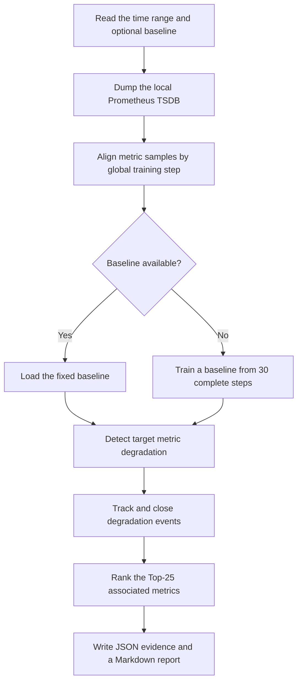

# Offline degradation association

Analyze a user-selected time range directly from RL-Insight's local Prometheus
TSDB. The first step value visible after the selected start is skipped as
potentially partial. The next 30 complete steps train a baseline when one is not
supplied; later steps are checked for target events and Top-25 associations.

## Install

```bash
pip install -e ".[degradation]"
```

## Prompt

Copy either prompt below, then fill in the baseline and detection time range.

### 中文

```text
开启劣化关联监控

基线：<加载已有基线时填写基线文件路径；无可用基线时填写“重新训练基线”>
检测时间段：<开始时间> 至 <结束时间>
是否 reset：否
```

### English

```text
Start degradation association monitoring

Baseline: <enter the existing baseline file path to load it; if no baseline is available, enter "Retrain baseline">
Detection time range: <start time> to <end time>
Reset: No (default)
```

Use Unix seconds or ISO-8601 timestamps with a timezone for the detection time
range. `reset` defaults to `否` / `No`; it is an instruction for the repository
Skill, not a `perf_analysis` CLI option.

## Algorithm flow

The analyzer converts local RL training metrics into step-aligned evidence,
detects degradation events against a fixed baseline, and ranks the metrics most
strongly associated with each event.



The default TSDB is `~/.rl-insight/data/prometheus`. Use `--data-dir`,
`--promtool`, `--analysis-dir`, or `--baseline-file` to override the respective
paths.

The CLI writes deterministic baseline, event, and analysis JSON. The repository
Skill at `.agent/skills/degradation-association-offline/SKILL.md` turns the final
association evidence into the grouped Markdown report and root-cause summary.
